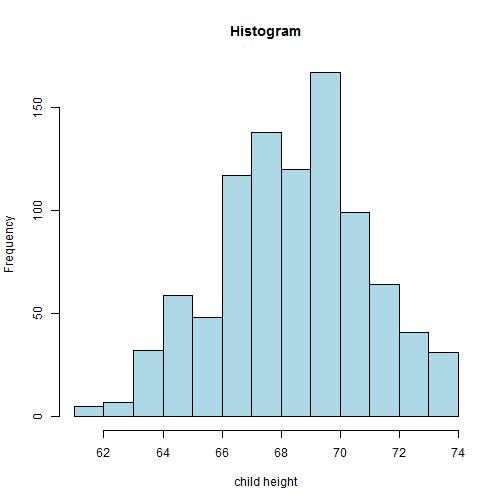
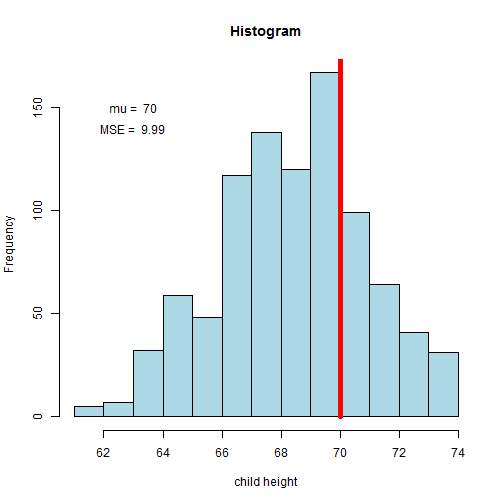

## Outlines

1. Summary of the data set "galton"
2. Interactive histogram of child height 
 

--- .class #id 

## galton data and summary


```r
data(galton)
summary(galton)
```

```
##      child           parent     
##  Min.   :61.70   Min.   :64.00  
##  1st Qu.:66.20   1st Qu.:67.50  
##  Median :68.20   Median :68.50  
##  Mean   :68.09   Mean   :68.31  
##  3rd Qu.:70.20   3rd Qu.:69.50  
##  Max.   :73.70   Max.   :73.00
```

--- .class #id 

## Histogram of the child height


```r
hist(galton$child, xlab='child height', col='lightblue',main='Histogram')
```




--- .class #id 

## select a mean equal to 70 and put this line on top of the Histogram. Mean square error is calculated.


```r
      hist(galton$child, xlab='child height', col='lightblue',main='Histogram')
      mu <- 70
      lines(c(mu, mu), c(0, 200),col="red",lwd=5)
      mse <- mean((galton$child - mu)^2)
      text(63, 150, paste("mu = ", mu))
      text(63, 140, paste("MSE = ", round(mse, 2)))
```



